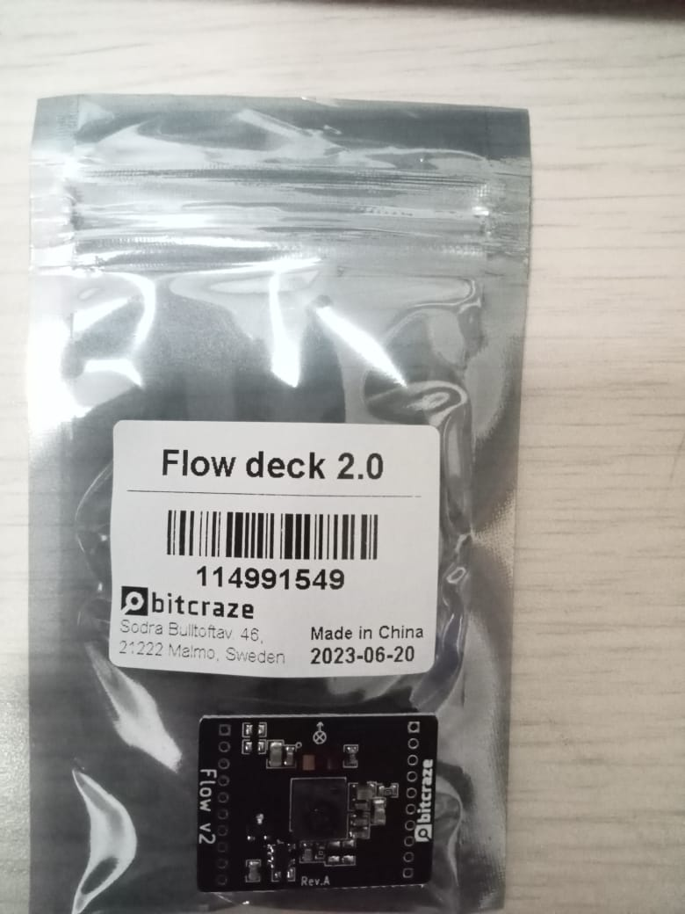
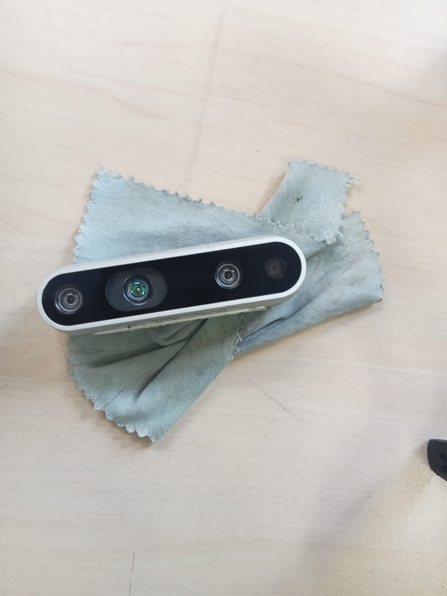
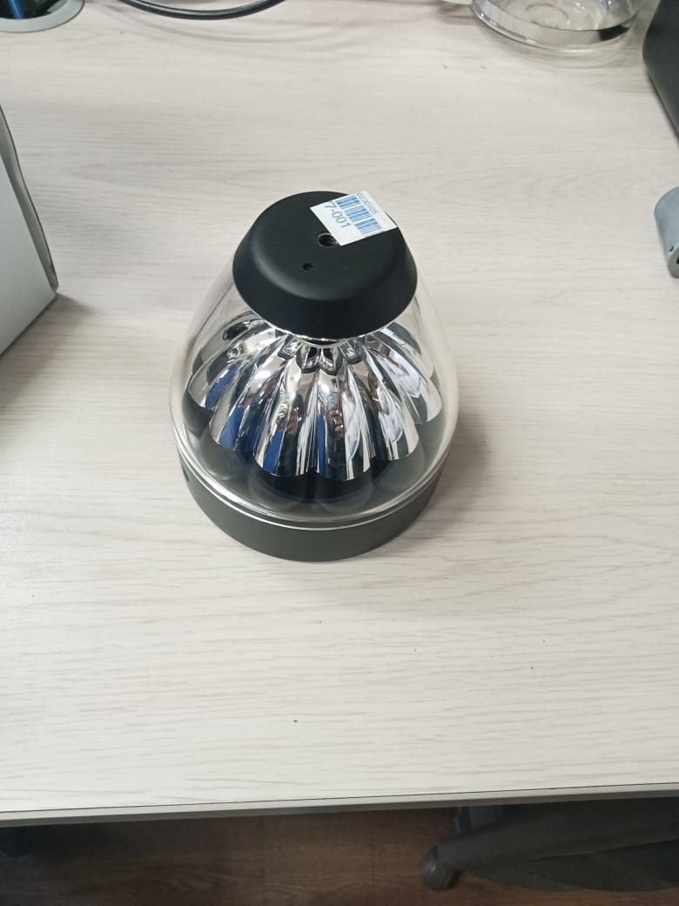
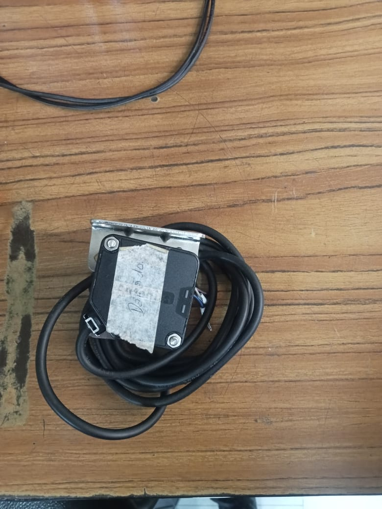
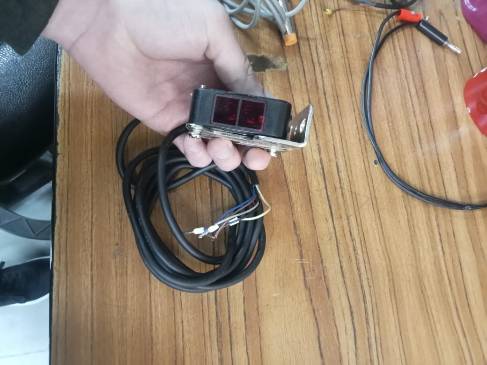
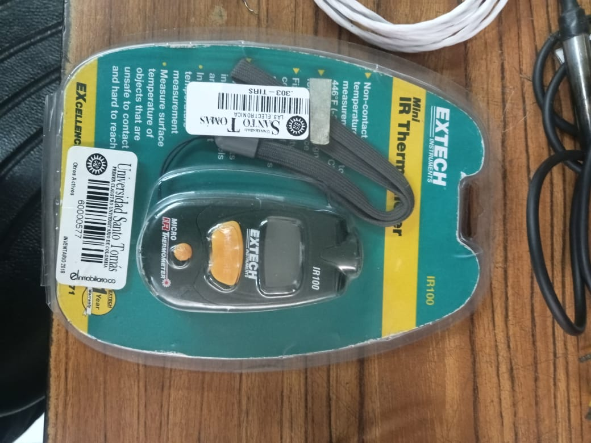
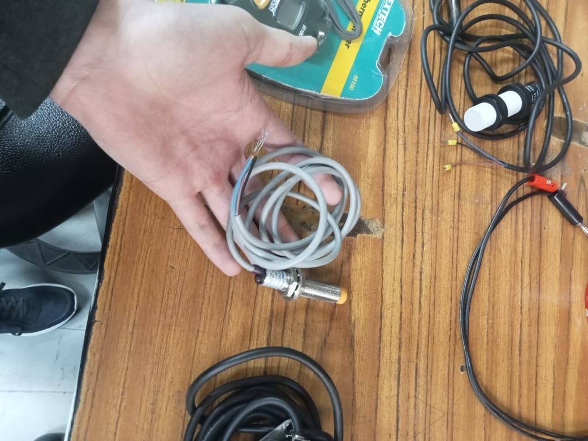
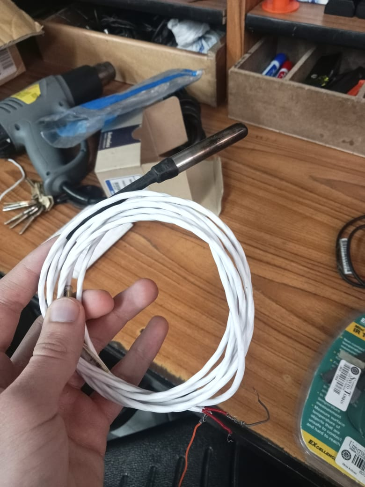
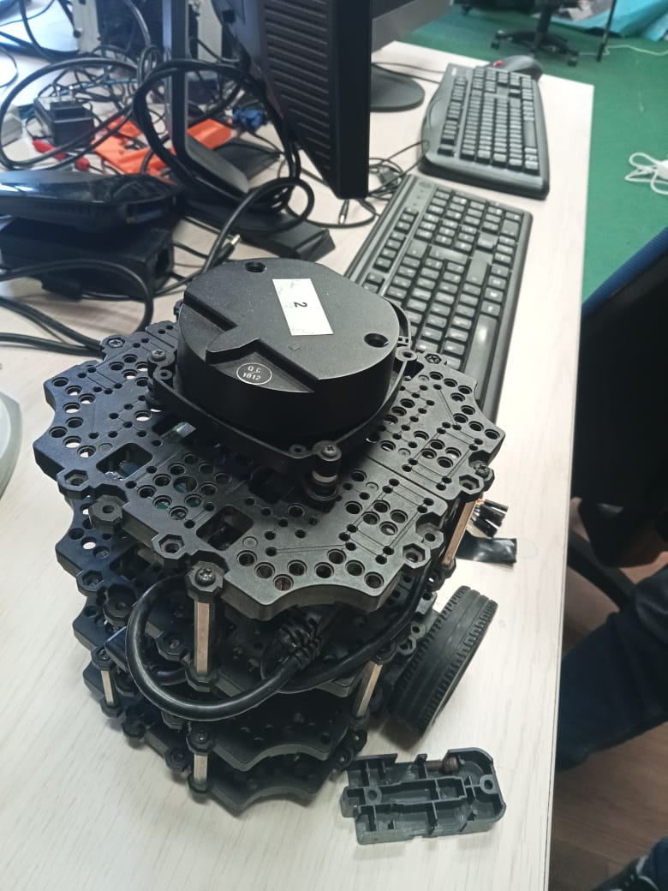

# Sensores y Equipos del Laboratorio de Electrónica

## 1. Flow deck 2.0 (Bitcraze)

Módulo de flujo óptico y medición de distancia diseñado para drones Crazyflie, que utiliza una cámara de baja resolución y un sensor de distancia por tiempo de vuelo (ToF) para estimar movimiento horizontal y altura sobre el suelo, permitiendo un vuelo más estable en interiores sin GPS.  
**Referencia:** [Flow deck 2.0 - Bitcraze](https://www.bitcraze.io/products/flow-deck-v2/)
**Fuente:** [Propia]
---

## 2. Intel RealSense Depth Camera (serie D400, probable D435 o D415)

Cámara de profundidad estéreo que combina dos sensores infrarrojos, un proyector de patrón IR y una cámara RGB para capturar imágenes 3D en tiempo real, utilizada en robótica, visión artificial y mapeo de entornos.  
**Referencia:** [Intel RealSense D435](https://www.intelrealsense.com/depth-camera-d435/)

---

## 3. Sensor LIDAR 3D Velodyne (posible modelo VLP-16 “Puck”)

LIDAR tridimensional de 360° que utiliza múltiples haces láser para capturar nubes de puntos en 3D del entorno, empleado en robótica avanzada, vehículos autónomos y sistemas de mapeo para generar modelos precisos del espacio circundante.  
**Referencia:** [Velodyne VLP-16](https://velodynelidar.com/products/puck/)

---

## 4. Sensor fotoeléctrico reflexivo
  

Sensor con carcasa plástica negra y ventanas frontales rojas, diseñado para detectar la presencia o ausencia de objetos sin contacto físico. Funciona emitiendo un haz de luz infrarroja que se refleja en el objeto y es recibido por el fotodetector. Incluye soporte metálico en “L” y cable multiconductor para alimentación y señal de salida.  
**Referencia:** [Sensor fotoeléctrico - Wikipedia](https://es.wikipedia.org/wiki/Sensor_fotoel%C3%A9ctrico)

---

## 5. Termómetro infrarrojo portátil

Dispositivo para medición de temperatura sin contacto que utiliza radiación infrarroja para determinar la temperatura superficial de objetos a distancia, ideal para superficies calientes, peligrosas o de difícil acceso.  
**Referencia:** [Termómetro infrarrojo - Wikipedia](https://es.wikipedia.org/wiki/Term%C3%B3metro_de_infrarrojos)

---

## 6. Sensor inductivo de proximidad

Sensor de proximidad cilíndrico que detecta objetos metálicos sin contacto mediante un campo electromagnético. Dispone de carcasa roscada para montaje y cableado fijo.  
**Referencia:** [Sensor inductivo - Wikipedia](https://es.wikipedia.org/wiki/Sensor_inductivo)

---

## 7. Sonda de temperatura encapsulada

Sensor de temperatura con elemento NTC/PT100/PT1000 o digital, protegido en tubo metálico de acero inoxidable y cableado largo para mediciones a distancia en líquidos, gases o superficies.  
**Referencia:** [Sonda de temperatura - Wikipedia](https://es.wikipedia.org/wiki/Termorresistencia)

---

## 8. Sensor LIDAR rotativo

Dispositivo que emite pulsos láser y mide el tiempo que tardan en regresar para mapear distancias y generar un escaneo en 2D del entorno, usado en robótica para navegación y evitación de obstáculos.  
**Referencia:** [LIDAR - Wikipedia](https://es.wikipedia.org/wiki/Lidar)

## 9. Multímetro Digital UNI-T UT39A+
  
Instrumento portátil que mide voltaje, corriente, resistencia, continuidad y otros parámetros eléctricos.  
**Referencia:** [Manual UNI-T UT39A+](https://www.uni-trend.com/manual/UT39A+.pdf)

## 10. Anemómetro y Aerogenerador de Pequeña Escala
  
- **Anemómetro:** Mide la velocidad del viento mediante copas giratorias.  
- **Aerogenerador:** Convierte energía cinética del viento en electricidad para fines de demostración o estudio.  
**Referencia Anemómetro:** [Anemómetro - Wikipedia](https://es.wikipedia.org/wiki/Anem%C3%B3metro)  
**Referencia Aerogenerador:** [Aerogenerador - Wikipedia](https://es.wikipedia.org/wiki/Aerogenerador)

