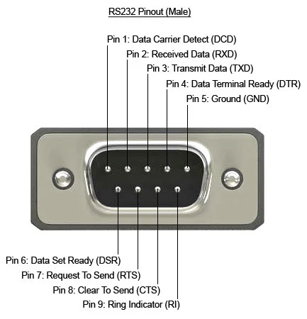

# 📚 Tarea 2 — Código ASCII y Protocolo RS232

## 1. Código ASCII

**Historia:**  
El código ASCII (*American Standard Code for Information Interchange*) fue creado en 1963 por el comité X3 del **American National Standards Institute (ANSI)** para estandarizar la representación de caracteres en computadoras y sistemas de comunicación. En 1967 se estableció la versión definitiva con 128 códigos que incluyen letras, números, signos de puntuación y caracteres de control.

**Funcionamiento:**  
ASCII asigna a cada carácter un número en binario (7 bits). Por ejemplo, la letra **A** corresponde al decimal 65 (binario 1000001). Estos valores se transmiten como señales eléctricas o se almacenan en formato digital.

**Descripción breve:**  
Es un sistema de codificación que traduce caracteres alfanuméricos y símbolos en números binarios para que puedan ser procesados, transmitidos o almacenados por dispositivos electrónicos.

---

## 2. Pines de conectores DB9 y DB25 en RS232

### 🔹 Conector DB9

| Pin | Nombre                      | Función                        |
|-----|-----------------------------|---------------------------------|
| 1   | DCD (Data Carrier Detect)    | Detección de portadora          |
| 2   | RXD (Receive Data)           | Recepción de datos              |
| 3   | TXD (Transmit Data)          | Transmisión de datos            |
| 4   | DTR (Data Terminal Ready)    | Terminal lista                  |
| 5   | GND (Signal Ground)          | Tierra de señal                 |
| 6   | DSR (Data Set Ready)         | Módem listo                     |
| 7   | RTS (Request to Send)        | Solicitud para enviar           |
| 8   | CTS (Clear to Send)          | Listo para enviar               |
| 9   | RI (Ring Indicator)          | Indicador de timbrado           |

**Imagen del conector DB9:**

---

-### 🔹 Conector DB25

| Pin | Nombre                      | Función                        |
|-----|-----------------------------|---------------------------------|
| 1   | GND Chasis                  | Tierra del chasis               |
| 2   | TXD (Transmit Data)         | Transmitir datos                |
| 3   | RXD (Receive Data)          | Recibir datos                   |
| 4   | RTS (Request to Send)       | Solicitud para enviar           |
| 5   | CTS (Clear to Send)         | Listo para enviar               |
| 6   | DSR (Data Set Ready)        | Módem listo                     |
| 7   | GND Señal                   | Tierra de señal                 |
| 8   | DCD (Data Carrier Detect)   | Detección de portadora           |
| 20  | DTR (Data Terminal Ready)   | Terminal lista                  |
| 22  | RI (Ring Indicator)         | Indicador de timbrado           |

-**Imagen del conector DB25:**

- ⚠️ Algunos pines restantes se reservan o se usan para funciones específicas según el fabricante.

---

## 3. Formato del protocolo RS232

El protocolo **RS232** define cómo se envían datos en serie entre dispositivos electrónicos. Establece voltajes, estructura de bits y sincronización.

**Características principales:**
- **Voltajes:**  
  - Lógica 1: entre −3 V y −15 V  
  - Lógica 0: entre +3 V y +15 V
- **Velocidades comunes:** 300 a 115200 baudios.
- **Formato típico de trama:**
  - 1 bit de inicio (0 lógico)
  - 5 a 8 bits de datos
  - Bit opcional de paridad
  - 1 o 2 bits de parada (1 lógico)
- **Transmisión asíncrona**: no se requiere reloj compartido.
- **Aplicaciones comunes**: comunicación PC–módem, impresoras, equipos industriales.

**Ejemplo de trama de 8 bits con paridad:**
