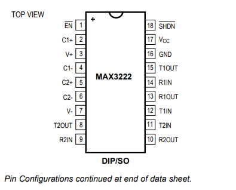
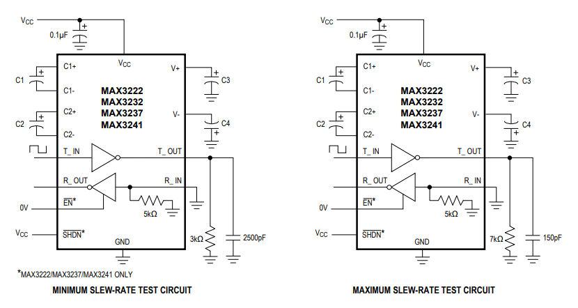

# MAX232

Índice
1. Introducción
2. Esquema Eléctrico
3. Funcionamiento
4. Variantes y Versiones
5. Prestaciones Típicas
6. Aplicaciones Actuales
7. Ventajas y Desventajas
8. Conclusión
9. Recursos Adicionales

## Introducción
El MAX3232 es un transceptor de nivel lógico diseñado para proporcionar comunicación RS-232 real utilizando una sola fuente de alimentación de +3.0V a +5.5V. A diferencia del clásico MAX232 (limitado a 5V), este dispositivo es ideal para equipos portátiles y sistemas modernos que operan con voltajes más bajos.

Incorpora un doble generador de carga (charge pump) que permite generar internamente los voltajes necesarios para cumplir con el estándar RS-232, eliminando la necesidad de fuentes de ±12V. Solo requiere cuatro capacitores externos de 0.1µF, lo que simplifica el diseño y reduce el espacio en la placa.

El MAX3232 integra 2 transmisores y 2 receptores, siendo totalmente compatible en pines y funcionalidad con el MAX232, pero ofreciendo mayor flexibilidad en aplicaciones de bajo voltaje. Además, mantiene velocidades de transmisión de hasta 120kbps, garantizando niveles de salida adecuados para comunicación confiable.

Su bajo consumo energético, junto con la capacidad de operar en un amplio rango de voltaje, lo hace especialmente adecuado para:

Equipos alimentados por batería

Dispositivos portátiles

Periféricos de comunicación

Sistemas de telecomunicaciones y datacom

En resumen, el MAX3232 es una evolución del clásico MAX232, optimizada para entornos de bajo voltaje, bajo consumo y alta confiabilidad, manteniendo la simplicidad de implementación que caracteriza a esta familia de transceptores.

## Esquema Eléctrico

Diagrama de Pines (DIP-16)  
  
Referencia: [datasheet](https://www.analog.com/media/en/technical-documentation/data-sheets/max3222-max3241.pdf) 
Fuente: Propia

## Conexión Típica  
  
Referencia: [datasheet](https://www.analog.com/media/en/technical-documentation/data-sheets/max3222-max3241.pdf)  
Fuente: Propia

Para operar el MAX232, se requieren cuatro capacitores externos (generalmente 1µF a 22µF, electrolíticos o cerámicos) que actúan como bombas de carga para generar los voltajes positivos y negativos necesarios para el RS-232.

## Funcionamiento
El MAX232 integra dos drivers (transmisores) y dos receptores:

1. Convertidor de Niveles de Voltaje  
   Utiliza un duplicador de voltaje y un inversor de voltaje con capacitores externos para generar aproximadamente +10V y -10V a partir de una alimentación de +5V.

2. Drivers (TTL → RS-232)  
   Entradas: T1IN/T2IN (0-5V TTL).  
   Salidas: T1OUT/T2OUT (±10V RS-232).

3. Receptores (RS-232 → TTL)  
   Entradas: R1IN/R2IN (±3V a ±15V RS-232).  
   Salidas: R1OUT/R2OUT (0-5V TTL).

## Variantes y Versiones

MAX232   | Versión original, requiere capacitores de 1µF a 22µF
MAX232A  | Funciona con capacitores de 0.1µF (más pequeños y baratos)
MAX3232  | Opera entre 3V y 5.5V, soporta mayor velocidad
MAX202   | Similar al MAX232 pero con hasta 120kbps
MAX233   | No requiere capacitores externos (más costoso)

## Prestaciones Típicas
Voltaje de Alimentación: +5V ±10%  
Consumo de Corriente: 8mA típico  
Velocidad de Transmisión: Hasta 120kbps (según variante)  
Rango de Entrada RS-232: ±30V  
Temperatura de Operación: 0°C a 70°C (comercial) / -40°C a +85°C (industrial)  

## Aplicaciones Actuales
Sistemas Industriales: mantenimiento de equipos legacy  
Instrumentación: comunicación con instrumentos de medición  
Proyectos Educativos: enseñanza de comunicación serial  
Dispositivos Médicos: compatibilidad con equipos antiguos  
Desarrollo Embebido: prototipado rápido con microcontroladores (AVR, PIC, Arduino)  

## Ventajas y Desventajas

Ventajas
Simplicidad de implementación  
Confiable y probado en la industria  
Bajo costo y fácil de conseguir  
Compatible con la mayoría de microcontroladores  

Desventajas
Considerado obsoleto frente a USB/Ethernet  
Requiere capacitores y voltajes más altos  
Limitado en velocidad  
Mayor consumo que conversores modernos USB-UART  

## Conclusión
El MAX232 fue clave en la comunicación serial por décadas.  
Aunque existen alternativas modernas, sigue siendo útil en proyectos legacy y educativos gracias a su simplicidad y bajo costo.  
Hoy en día, para nuevos diseños se recomiendan convertidores USB-UART (ej. CH340, FT232RL), pero el MAX232 conserva su valor histórico en electrónica.

## Recursos Adicionales
Datasheet MAX232: https://www.analog.com/media/en/technical-documentation/data-sheets/MAX220-MAX249.pdf  
RS-232 en Wikipedia: https://es.wikipedia.org/wiki/RS-232  
Tutorial de Implementación: https://www.electronics-tutorials.ws/blog/max232-interfacing-circuit.html  
